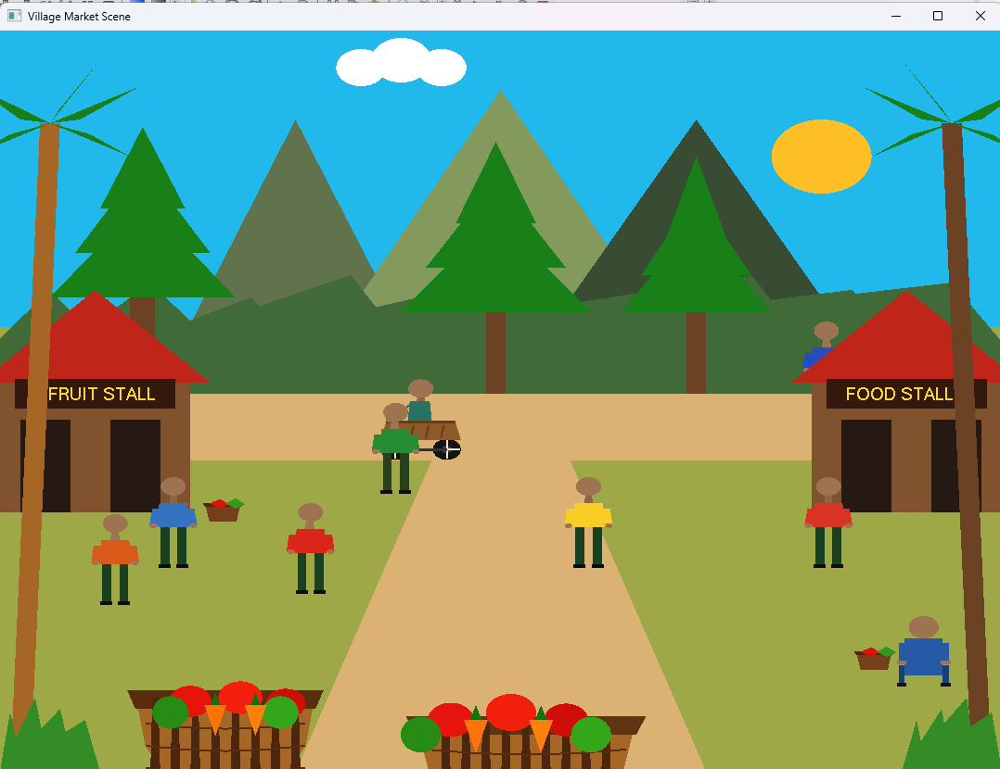
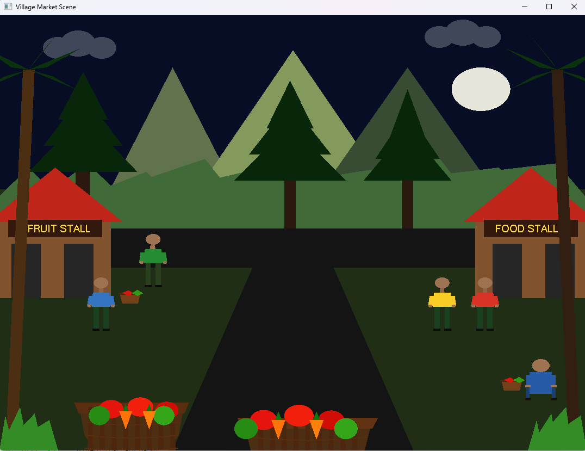
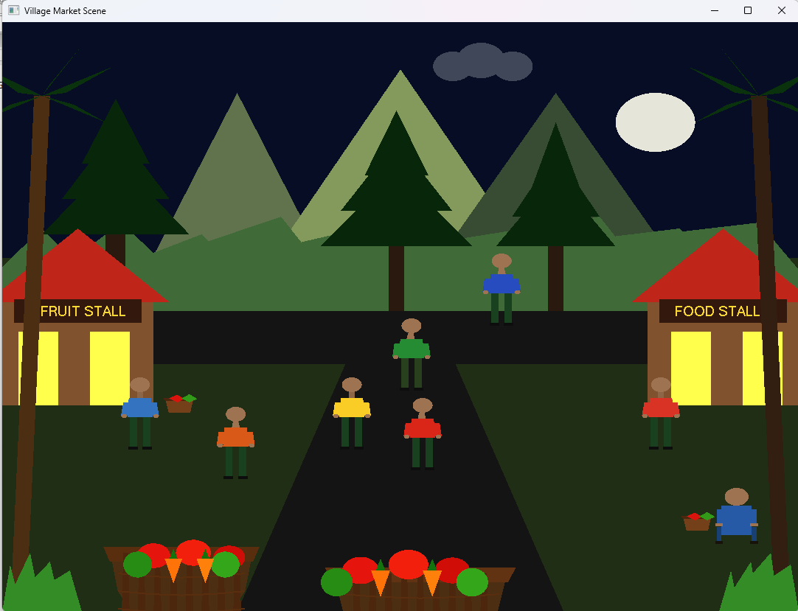

# Village Market Scene using C++ & OpenGL

## 📌 Project Overview

This project is a 2D animated village market scene developed as a Computer Graphics course project using **C++ and OpenGL (GLUT)**.

The main objective of this project is to implement computer graphics concepts such as object drawing, animation, transformation, and user interaction to create a realistic village environment.

## 🛠️ Technologies Used

- C++
- OpenGL
- GLUT Library
- Code::Blocks

## ✨ Features

- 🌞 Day and Night Transition System
- 🌙 Sun/Moon Environment Change
- ☁️ Moving Cloud Animation
- 🛒 Animated Cart with Rotating Wheels
- 🚶 Moving People Animation
- 💡 Stall Light ON/OFF Control
- 🔊 Background Sound System
- ⌨️ Keyboard Interaction

## 🎮 Controls

| Key | Function |
|-----|----------|
| N | Change Day/Night |
| L | Stall Light ON/OFF |
| M | Sound ON/OFF |
| W | Increase Speed |
| S | Decrease Speed |
| A/D | Control Cart Movement |

## 📷 Screenshots

### Day Scene

### Night Scene

### Stall Light ON/OFF System

## 📚 Learning Outcomes

Through this project, I learned:

- 2D object rendering using OpenGL primitives
- Coordinate system and transformations
- Animation implementation
- Keyboard event handling
- Creating interactive graphical environments

## 👨‍💻 Developer

**Fahim Nahin**  

🎓 Computer Science & Engineering (CSE) Student  
🏫 American International University-Bangladesh (AIUB)  

📌 **Course:** Computer Graphics  
